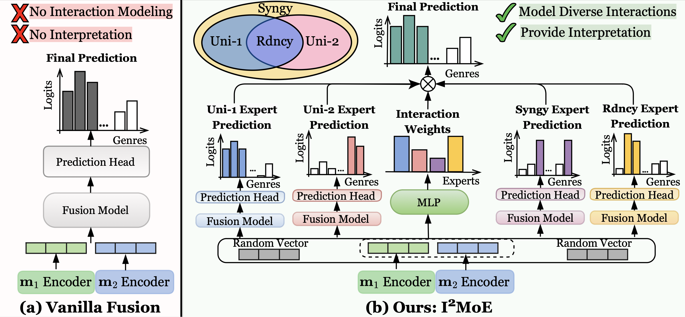

# I<sup>2</sup>MoE: Interpretable Multimodal Interaction-aware Mixture-of-Experts
[](https://opensource.org/licenses/MIT) [](https://icml.cc/)

Official implementation for "I<sup>2</sup>MoE: Interpretable Multimodal Interaction-aware Mixture-of-Experts" accepted by ICML 2025 (Poster).  

- Authors: [Jiayi Xin](https://www.linkedin.com/in/jiayi-xin-978511334/), [Sukwon Yun](https://sukwonyun.github.io/), [Jie Peng](https://openreview.net/profile?id=~Jie_Peng4), [Inyoung Choi](https://www.linkedin.com/in/inyoung-choi-77105221b/), [Jenna Ballard](https://www.linkedin.com/in/jenna-ballard-81b7b3168/), [Tianlong Chen](https://tianlong-chen.github.io/) and [Qi Long](https://www.med.upenn.edu/long-lab/currentgroupmembers.html)
- Paper Link: https://arxiv.org/abs/2505.19190

## Overview
Modality fusion is a cornerstone of multimodal learning, enabling information integration from diverse data sources. However, vanilla fusion methods are limited by **(1)** inability to account for heterogeneous interactions between modalities and **(2)** lack of interpretability in uncovering the multimodal interactions inherent in the data. To this end, we propose **I²MoE** (**I**nterpretable Multimodal **I**nteraction-aware **M**ixture **o**f **E**xperts), an end-to-end MoE framework designed to enhance modality fusion by explicitly modeling diverse multimodal interactions, as well as providing interpretation on a local and global level. First, I<sup>2</sup>MoE utilizes different interaction experts with weakly supervised interaction losses to learn multimodal interactions in a data-driven way. Second, I<sup>2</sup>MoE deploys a reweighting model that assigns importance scores for the output of each interaction expert, which offers sample-level and dataset-level interpretation. Extensive evaluation of medical and general multimodal datasets shows that I<sup>2</sup>MoE is flexible enough to be combined with different fusion techniques, consistently improves task performance, and provides interpretation across various real-world scenarios.




## Environment Setup
```shell
conda create -n i2moe python=3.10 -y
conda activate i2moe
pip install -r requirements.txt
```

## Data Directory

Create data directory under `./data`

### Reproduce experimemnt results

- `adni` dataset: follow [Readme](https://github.com/UNITES-Lab/Flex-MoE/blob/main/data/adni/README.md) from [Flex-MoE](https://github.com/UNITES-Lab/Flex-MoE/).
- `mimic` dataset: download MIMIC-IV v3.1 from [PhysioNet](https://physionet.org/) and follow preprocessing procedure in Appendix E.4.
- `mmimdb`, `mosi`, and `enrico` datasets: download datasets following links in [MultiBench](https://arxiv.org/abs/2107.07502).

### Add new datasets
1. Add preprocessing code of your new dataset under `src/common/datasets/<your_dataset>.py`
2. If appropriate, add customized dataloader of your new dataset to `src/common/datasets/MultiModalDataset.py`

```python
    elif dataset == "<your_dataset>":
        # if False:
        train_loader = DataLoader(
            train_dataset,
            batch_size=batch_size,
            shuffle=True,
            collate_fn=collate_fn_<your_dataset>,
            num_workers=num_workers,
            pin_memory=pin_memory,
        )
        val_loader = DataLoader(
            valid_dataset,
            batch_size=batch_size,
            shuffle=False,
            collate_fn=collate_fn_<your_dataset>,
            num_workers=num_workers,
            pin_memory=pin_memory,
        )
        test_loader = DataLoader(
            test_dataset,
            batch_size=batch_size,
            shuffle=False,
            collate_fn=collate_fn_<your_dataset>_test,
            num_workers=num_workers,
            pin_memory=pin_memory,
        )
```

## Train Models

### Train I<sup>2</sup>MoE models

- Supported fusion methods: `<fusion>` in `transformer`, `interpretcc`, `moepp`, `switchgate`.
- Supported datasets:`<dataset>` in `adni`, `mimic`, `mmimdb`, `mosi_regression`, `enrico`.

```shell
source scripts/train_scripts/imoe/<fusion>/run_<dataset>.sh
```

### Train vanilla fusion models

- Supported fusion methods: `<fusion>` in `transformer`, `interpretcc`, `moepp`, `switchgate` and other fusion (`ef`, `lf`, `lrtf`).
- Supported datasets:`<dataset>` in `adni`, `mimic`, `mmimdb`, `mosi_regression`, `enrico`.

```shell
# For <fusion> in ["transformer", "interpretcc", "moepp", "switchgate"]
source scripts/train_scripts/baseline/<fusion>/run_<dataset>.sh
# For <fusion> in ["ef", "lrtf", "lf"]
source scripts/train_scripts/baseline/other_fusion/run_<dataset>.sh

```

## Ablations of I<sup>2</sup>MoE

- Supported datasets:`<dataset>` in `adni`, `mimic`, `mmimdb`, `mosi_regression`, `enrico`.

```shell
source scripts/train_scripts/latent_contrastive/transformer/run_<dataset>.sh
source scripts/train_scripts/less_perturbed_forward/transformer/run_<dataset>.sh
source scripts/train_scripts/synergy_redundancy_only/transformer/run_<dataset>.sh
source scripts/train_scripts/simple_weighted_average/transformer/run_<dataset>.sh
source scripts/train_scripts/no_interaction_loss/transformer/run_<dataset>.sh
```

## Citation
```
@article{xin2025i2moe,
  title={I2MoE: Interpretable Multimodal Interaction-aware Mixture-of-Experts},
  author={Xin, Jiayi and Yun, Sukwon and Peng, Jie and Choi, Inyoung and Ballard, Jenna L and Chen, Tianlong and Long, Qi},
  journal={arXiv preprint arXiv:2505.19190},
  year={2025}
}
```
